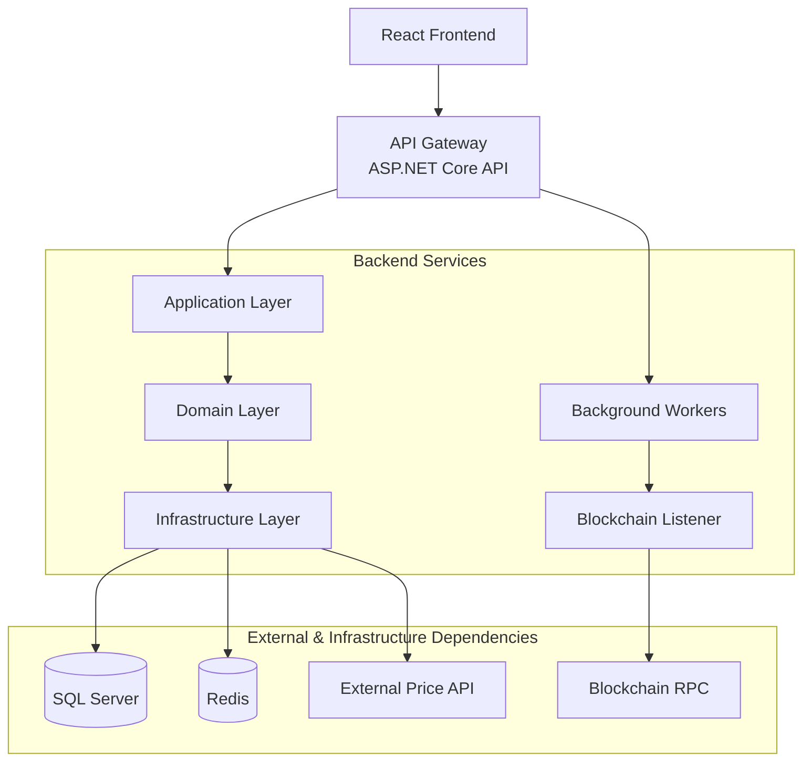

# Waillet

A custodial crypto wallet web app that allows users to:

- Hold crypto (BTC, ETH)
- Convert between assets
- Track portfolio
- View transaction history

*This is a personal coding project. Not going to be launched.*

## High-Level System Architecture

### Frontend - In progress

- Blazor (interactive server)
- Auth UI (login + sign-up)
- Wallet Dashboard 
- Swap screen 
- History

### Backend - In progress

- .NET API

Core services:

- Auth Service - DONE
- Wallet Service - DONE
- Ledger Service 
- Blockchain Service 
- Conversion Service 
- Pricing Service

Infrastructure

- SQL Server (ledger + users)
- Redis (price cache)
- Blockchain RPC providers
- Background workers

## Frontend Setup

### Blazor Client

- Configure the API base URL in Waillet.Blazor appsettings.json or appsettings.Development.json:
    - ApiBaseUrl: https://localhost:7005/
- Run the API and Blazor apps together so the login page can call the /api/auth endpoints.

## High-Level System Architecture Diagram

